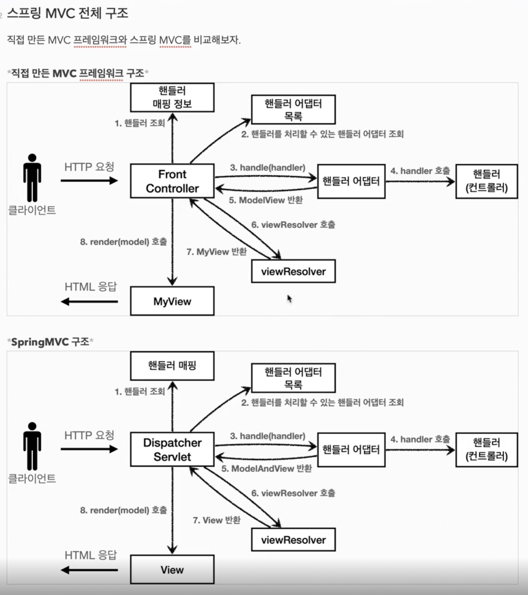

- jar : 내장 톰캣 간단 빌드
- war : 톰캣서버 별도 설정

### HttpServletRequest 개요
- HttpServletRequest, HttpServletResponse 객체들은 HTTP요청 메시지, HTTP응답 메시지를 
편리하게 사용하도록 도와주는 객체

### HTTP 요청 데이터 개요
- GET - 쿼리 파라미터
- POST - HTML Form
- HTTP message body

### HTTP 응답 데이터 
- 단순 Text응답 (writer.println("ok"))
- HTML응답
- HTTP API - MessageBody JSON응답

--- 
- HttpServletRequest
- HttpServletResponse

- MVC로 나뉜 이유
  - Servlet or JSP 로만 작성을 하려면 ***역할이 너무 많아진다***
  - 설계에서 나누는 포인트는, 변경 주기(Life Cycle)를 두고 나눠도 설계가 깔끔해진다.
  - 최적화된 특성을 살리는게 중요하다.

- MVC 패턴의 한계?
  - 중복된 코드가 존재한다.
  - 사용하지 않는 리소스가 존재한다.

- 해결책
  - Front Controller Pattern

- Servlet, jsp -> mvc pattern
  - jsp가 필요해진 이유 -> servlet 코드에서 view 영역을 분리시키기 위해(html 코드가 많아 유지보수 어려워진다)
  - jsp를 통해 java언어로 html출력이 수월해진다.

- MVC 프레임워크 만들기

---
Front controller 패턴 복습
---
V5
Adapter Pattern
한 가지 타입의 컨트롤러 Interface만 사용 -> 여러 Controller Interface사용이 가능하도록

프론트 컨트롤러가 다양한 방식의 컨트롤러를 처리ㅎ할 수 있도록 변경

---
### v1 -> v2 -> v3 -> v4 -> v5 점진적인 발전
#### V1 : 프론트 컨트롤러 도입
- 기존 구조를 최대한 유지하면서 프론트 컨트롤러 도입
#### V2 : View 분류
- 단순 반복 되는 뷰 로직 분리
#### V3 : Model 추가
- 서블릿 종속성 제거
- 뷰 이름 중복 제거
#### V4 : 단순하고 실용적인 컨트롤러
- v3와 비슷
- 구현 입장에서 ModelView를 직접 생성해서 반환하지 않도록 편리한 Interface 제공
#### V5 : 유연한 컨트롤러
- 어댑터 도입
- 어댑터를 추가해서 프레임워크를 유연하고 확장성 있게 설계

ex) annotaion을 지원하는 컨트롤러를 사용할 수 있게 기능을 확장할 수 있다.

---
실제 스프링 MVC 구조 이해

### MVC 전체구조

- DispatcherServlet 알아보기

### 핸들러 매핑, 핸들러 어댑터

### 뷰 리졸버

### MVC 시작, 컨트롤러 통합, 실용적인 방식!

---
spring controller 는 @annotation기반으로 동작한다.